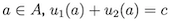
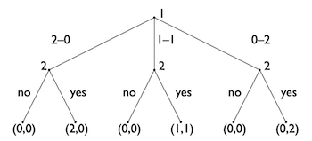
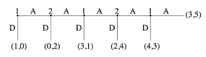
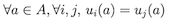

# Commonly Known Games

Here is an overview of commonly known games and their analysis.

## Games of Pure Competition

In games of pure competition, the two players have *exactly opposed* interests. The sum of each of there action profiles need to be constant:

The special case is the **zero-sum game**, where the constant is zero.

Understanding these games, we only have to analyse one side, hence one player's interest, and only need to store one utility function, as it is the same for both players.

### Matching Pennies

Player one gets a reward when both players have the same side of the penny (head or tails), and player one gets a negative reward, when both players have different sides. Player one therefore tries to coordinate for the same sides and player two for different sides.

||Head|Tails|
|-|-|-|
|Head|1, -1|-1, 1|
|Tails|-1, 1|1, -1|

#### Solving

As with all these game (i.e. Rock, Paper, Scissors), the solution lies in applying a mixed strategy. When played repeatedly, here a 50:50 randomized strategy will yield the highest payoff (or 1/3, 1/3 1/3 for Rock, Paper, Scissors)

### Prisoner's Dilemma

||C|D|
|-|-|-|
|C|a,a|b,c|
|D|c,b|d,d|

with c > a > d > b

#### Example

||stay silent (O_S0)|tell (O_S1)|
|-|-|-|
|stay silent (P_S0)|-2, -2|-10, 0|
|tell (P_S1)|0, -10|-5, -5|

The only pure Nash Equilibrium is P_S1 and O_S1

Analysing strict dominance ...
   player has 1 strictly dominated strategies:
       P_S0
   player has 1 strictly dominant strategies:
       P_S1
   opponent has 1 strictly dominated strategies:
       O_S0
   opponent has 1 strictly dominant strategies:
       O_S1

#### Solving

The prisoner's dilemma can be solved by plying the game repeatedly **without** a notion of an ending. Then the strategy of building a reputation can help, so that both parties cooperate.

### Sharing Game

Player 1 has three pure strategies. She can either give 2 coins to player 1, she can split the two coins, so she gets 1 and he gets 1, or she can keep both coins.

Player 2 has eight pure strategies based on the three nodes. So one strategy could be to accept in all three possible nodes, or to decline in all three nodes, or to accept only in the first node, but to reject in the other two nodes ... This would then be the *cross product*, i.e. 2^3

### Centipede

#### Solving

Using backward induction, we see that player 1 can choose at the right most node between a payoff of 4 over 3, so he would choose D. Player 2 would on the next step also assume, that Player 1 would defect and therefore also defect (go down) to get 2. And so on, so that in this case Player 1 would as a first choice already go down for a payoff of 1. Even though the payoffs at a later stage would be better - for both.

## Games of Pure Cooperation

In a game of cooperation, players have the same interest, hence there is no conflict. In those games the payoff matrix has only one single payoff per cell, as they are the same for each player.

### Which side of the road

When two drivers meet on a road, we all know, that it is in there best interest, to either drive on there side on the left or on the the right. By this, they coordinate to not drive into each other.

||Left|Right|
|-|-|-|
|Left|1, 1|0, 0|
|Right|0, 0|1, 1|

## Mixed Games

The most interesting games combine elements of cooperation and competition.

### Battle of the Sexes

Imagine you want to spend the Friday night together with your significant other. But you would like to go to the Movies and watch Jason Bourne, but your significant other prefers a play in the Theatre.

One one side, both of you want to spend the evening together, so there is some need to cooperate and to coordinate, yet both of you have different preferences.

This is a classical scenario to show how communication can help to coordinate.

||Movies|Theatre|
|-|-|-|
|Movies|2, 1|0, 0|
|Theatre|0, 0|1, 2|

### #Solving

Solved by communication and coordination.

### Keynes Beauty Contest Game

The Stylized Version
* Each player names an integer between 1 and 100.
* The player who names the integer closest to two thirds of the average integer wins a prize, the other players get nothing.
* Ties are broken uniformly at random.

The Nash Equilibrium is is 1. Still not all people understand this and therefore do not chose 1. Interestingly, at Yale, the first run comes to somewhere 9 (median 13.3). While at Stanford the winner is at 23 (median 33).

--> common knowledge

# Tic Tac Toe

Here is my implementation of a Tic Tac Toe game using AI to simulate the opponent. Feel free trying to win against my AI :-). Spoiler: No chance

# Ultimatum (Bargaining)

A negotiation game in which the two sides take turns making offers and counteroffers was solved by Ariel Rubinstein in 1982.

-> backward induction

Two players A (proposer) and B (responder)

* A is endowed with some amount (x) of a good (usually money).
* A makes an offer to B consisting of a transfer of y < x.
* B accepts or rejects the offer.

Payoffs:
* B accepts: A: x-y, B:y
* B rejects: everyone 0

Prediction: (SPNE) y=0, B accepts.

Observed Outcome: (roughly) y<0.2x are rejected and offers are usually in range 0.2x-0.6x with extra weight around ‘fair’ splits (50:50).

# Voting Game [^1]

A parliament is made up of four political parties, A, B, C, and D,
which have 45, 25, 15, and 15 representatives, respectively. They are to vote on whether to pass a $100 million spending bill and how much of this amount should be controlled by each of the parties. A majority vote, that is, a minimum of 51 votes, is required in order to pass any legislation, and if the bill does not pass then every party gets zero to spend. [^1]

Shapley values: (50, 16.67, 16.67, 16.67).

Still, A and B can form a coalition and gain each more (i.e. 75 / 25)

The **core** of a game is the set of all stable outcomes, i.e., outcomes that no coalition wants to deviate from.

[^1]: Game Theory Course: Jackson, Leyton-Brown & Shoham
[^2]: Güth, Werner, Rolf Schmittberger, and Bernd Schwarze (1982) “An Experimental Analysis of Ultimatum Bargaining”, Journal of Economic Behavior and Organization, 3:4 (December), 367-388.
