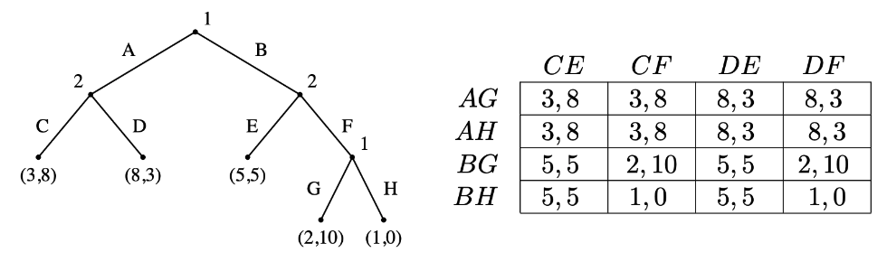

<!-- Top Navigation -->
* [Psychology](/psycholgy.md)
* Game Theory
   * [Negotiations](/negotiations.md)
   * [Some Games](/gt-games.md)
   * *Representation*
   * [Strategies for solving](/gt-strategies.md)
* [Python](/python.md)
* [Web Dev](/web-dev.md)

---

# Game Representation

**Players** who are the decision makers?

* People? Governments? Companies? Somebody employed by a Company?...

**Actions** what can the players do?

* Enter a bid in an auction? Decide whether to end a strike? Decide when to sell a stock? Decide how to vote?...

**Payoffs** what motivates players?

* Do they care about some profit? Do they care about other players?...

## Normal Form Game

* Lists what payoffs players get as a function of their actions.
* Does not incorporate any notion of sequence, or time, of the actions of the players.
* Usually represented by a matrix.

||U|*D*|
|-|-|-|
|*L*|a,a|*b,c*|
|R|c,b|d,d|

Player 1 in this scenario has the strategies of choosing left (L) or right (R). Whereas Player 2 cna either choose up (U) or down (D).

The payoffs they receive are as the following:
* Player 1 chooses L and Player 2 chooses D
    * Payoff for Player 1 is b
    * Payoff for Player 2 is c

## Extensive Form Game

* Includes timing of moves.
* Usually represented by a tree.

### Prefect Information Extensive Form Game

All players know the moves previously made by all other players.

Every game in extensive form can be converted into normal form. The reverse transformation is not always possible, e.g. matching pennies cannot be written as a perfect information extensive form game.

#### Theorem

> Every perfect information game in extensive form has a pure strategy Nash equilibrium.

### Imperfect Information Extensive Form Games

Player 2 doesn't know the move made by Player 1.

There are two meaningfully different kinds of randomized strategies in imperfect information extensive form games
* **Mixed strategy** randomize over pure strategies
* **Behavioural strategy** independent coin toss every time an information set is encountered

## Converting

Perfect information extensive form games can be written or transformed into normal form games by listing all the pure strategies for each player and then work the tree and note down the payoffs.

Simultaneous games cannot be converted from normal form to extensive form.