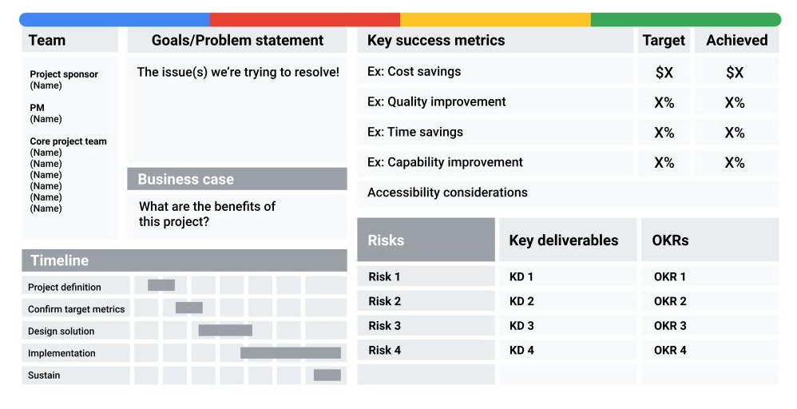

# Project Initiation

* Goals
* Scope
* Project deliverables
* Success criteria
* Stakeholders
* Resources

Active Listening

## Goals

### SMART goals: Making goals meaningful

* Specific: The objective has no ambiguity for the project team to misinterpret. 
* Measurable: Metrics help the project team determine when the objective is met.
* Attainable: The project team agrees the objective is realistic.
* Relevant: The goal fits the organization’s strategic plan and supports the project charter.
* Time-bound: The project team documents a date to achieve the goal.

Determining metrics can be extremely helpful in capturing statuses, successes, delays, and more in a project. As a project manager, identifying meaningful metrics can help move the project toward its goal. Additionally, by defining each element of a project goal to make it SMART, you can determine what success means for that goal and how to achieve it. 

### OKR

OKR stands for objectives and key results. They combine a goal and a metric to determine a measurable outcome. 
OKR development best practices

Here are some best practices to keep in mind when writing OKRs:

* Think of your objectives as being motivational and inspiring and your key results as being tactical and specific. The objective describes what you want to do and the key results describe how you’ll know you did it. 
* As a general rule, try to develop around 2–-3  key results for each objective.
* Be sure to document your OKRs and link to them in your project plan.

## Roles

A RACI chart can be an extremely effective way to define project roles, give direction to each team member and stakeholder, and ensure work gets done efficiently. Having a RACI chart available throughout the duration of your project as a quick visual can be invaluable. In this reading, we will cover the function of a RACI chart and its components and explore how project managers use RACI charts to define and document project roles and responsibilities. 

### Elements of a RACI chart

A RACI chart creates clear roles and gives direction to each team member and stakeholder. Over your career, you may hear a RACI chart referred to as a Responsibility Assignment Matrix (RAM), RACI diagram, or RACI matrix. The ultimate goal of this chart is to clarify each person’s role on your project. 

First, let’s break down each of the roles people can be assigned:

* R: Responsible: who gets the work done
* A: Accountable: who makes sure the work is done
* C: Consulted: who gives input or feedback on work
* I: Informed: who needs to know the outcome

Note that RACI charts can be organized in different ways,  depending on personal preference, number of tasks being assigned, and number of people involved. In the previous video, we showed you one RACI chart format. The template below shows another way a typical RACI chart might be organized.

## Project Charter

A project charter clearly defines the project and outlines the necessary details for the project to reach its goals. A well-documented project charter can be a project manager’s secret weapon to success.

Project charters will vary but usually include some combination of the following key information:

introduction/project summary
goals/objectives 
business case/benefits and costs
project team
scope
success criteria
major requirements or key deliverables
budget
schedule/timeline or milestones
constraints and assumptions
risks
OKRs
approvals

