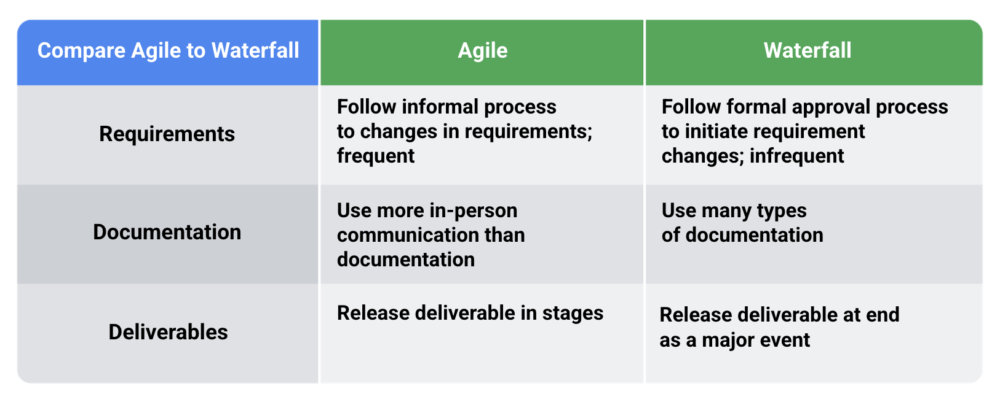

# Project Management

# different methodologies

* Waterfall
    * strict specifications with the strong need of sign-off proceures
* Scrum
    * unclear specifications
    * short iterations
* [Lean and Sigma Six](/pm-lean.md)
    * derived from manufacturing or product development environments
        * Lean method came out of Toyota—most specifically the Toyota Production System (TPS)
        * Six Sigma was initially utilized by Motorola and has since been adopted by other such organizations, including General Electric, Toshiba, and Boeing, among others.
    * these methodologies relate most naturally to manufacturing and product development work.

## some other popular methodologies

* Critical Path Method (CMP)
* Critical Chain Project Management
* Extreme Programming (XP)
* PRINCE2

## Agile and Waterfall

## different agile implementations / methodologies

### Scrum

Although Scrum was first used to describe Agile content in 1986 in the Harvard Business Review, the term originates from the internationally loved sport, rugby. In rugby, a “scrum” involves players huddling closely together with their heads down while trying to gain possession of the ball. Then, the players work together in order to achieve their shared goal: to get the ball across the line and score!

### Kanban

Kanban Board (Kan = sign and Ban = board)

Sure, Kanban is a popular Agile project management framework that emphasizes the visualization and optimization of workflow to improve efficiency and productivity. Here are some key points to keep in mind about Kanban:

- Visualize the workflow: Kanban uses a visual board to represent the workflow, with each step of the process represented by a column or swimlane. This allows the team to see the status of each task at a glance, and helps to identify bottlenecks and areas for improvement.

- Limit work in progress (WIP): Kanban places a strong emphasis on limiting the amount of work in progress at any given time. This helps to prevent overloading the team, reduces context switching, and allows them to focus on completing tasks before starting new ones.

- Continuous improvement: Kanban encourages teams to continually improve their processes and workflow by identifying and addressing bottlenecks, reducing waste, and optimizing the flow of work.

- Pull-based system: Kanban uses a pull-based system, where team members pull work from a backlog or queue as they have capacity, rather than having tasks assigned to them. This allows the team to work at their own pace, and helps to prevent overloading individual team members.

- Service delivery: Kanban is often used in service delivery contexts, such as IT support, software development, and customer service, where a steady flow of work needs to be managed and prioritized.

Overall, Kanban is a flexible and adaptable framework that can be used in a wide range of contexts to improve workflow, reduce waste, and increase efficiency. By visualizing the work, limiting WIP, and focusing on continuous improvement, teams can optimize their processes and deliver better results.

### XP

Sure! Extreme Programming (XP) is an Agile software development framework that emphasizes the importance of collaboration, feedback, and rapid iteration. Here are some key points to keep in mind about XP:

- Customer involvement: XP places a strong emphasis on customer involvement throughout the development process. Customers are seen as an integral part of the development team, and are involved in all aspects of the project, from planning to testing to deployment.

- Continuous feedback: XP promotes continuous feedback loops, with frequent testing and integration to ensure that the software is always working as intended. Feedback is also used to drive continuous improvement, with regular retrospectives to review progress and identify areas for improvement.

- Pair programming: XP encourages pair programming, where two developers work together at the same computer to write and review code. This helps to improve code quality, facilitate knowledge sharing, and reduce errors and bugs.

- Continuous delivery: XP promotes continuous delivery, with frequent releases of working software to the customer. This helps to ensure that the software is always up-to-date and meets the customer's needs.

- Simple design: XP emphasizes the importance of keeping the design of the software as simple as possible, with a focus on writing clean, maintainable code. This helps to reduce complexity, improve code quality, and make it easier to change and adapt the software as needed.

Overall, XP is a collaborative and iterative framework that prioritizes customer satisfaction, continuous feedback, and rapid delivery. By involving the customer throughout the development process, focusing on feedback and testing, and promoting simplicity and collaboration, XP can help teams to deliver high-quality software that meets the needs of their customers.

### Lean

### the spotify model

At Spotify, teams are broken down into what they call Squads. A Squad is like a Scrum Team and is supposed to feel like its own start-up within the company. Squads are self-organizing and collocated. They work together to achieve a long-term mission. At Spotify, a Squad may be in charge of a task such as improving the app’s usability for Android, improving the Spotify radio experience, or providing payment solutions. Just like a Scrum Team, the Squad doesn't have a formal leader, but they do have a Product Owner. Product Owners collaborate with one another to maintain a roadmap to track Spotify’s progress as a whole. Each team also has access to an Agile coach to encourage continuous improvements. Tribes are collections of squads that work in a specific area and are meant to have less than 100 people. Chapters are small groups of people across a tribe that have similar skills and work in the same general competency area. Guilds are the largest group, comprised of people across the organization who want to share knowledge, tools, code, and practices.